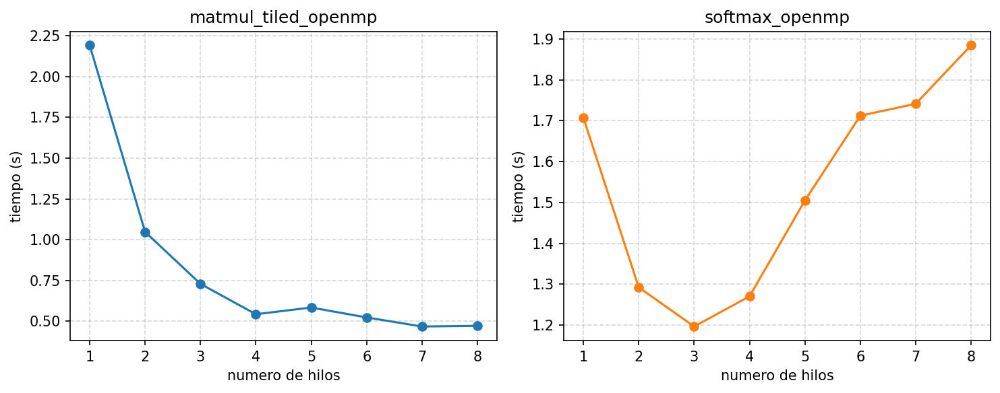

# Ejercicio B - matmul_tiled_openmp y softmax_openmp

Fabián Parreaguirre Hidalgo

Estos dos ya recibían el número de hilos por argumento, no tuve que tocar nada, solo correrlos de 1 a 8 y anotar el "Tiempo" que imprimen. Subí un poco las repeticiones respecto al default para que no fuera tan rápido y se notara el efecto: matmul con 512x512, tile 32, 20 repeticiones; softmax con 200000 repeticiones. Igual que en el ejercicio A, todo el barrido quedó en `medir.sh`/`tiempos.csv`.

| Hilos | matmul_tiled_openmp | softmax_openmp |
|---|---|---|
| 1 | 2.191364 | 1.707279 |
| 2 | 1.047927 | 1.292168 |
| 3 | 0.729133 | 1.196376 |
| 4 | 0.543329 | 1.270266 |
| 5 | 0.584214 | 1.504681 |
| 6 | 0.523592 | 1.712192 |
| 7 | 0.467993 | 1.741277 |
| 8 | 0.472101 | 1.884342 |

**matmul_tiled_openmp** sí escala como uno esperaría: baja rápido hasta 4 hilos y después se aplana (0.54s con 4 vs 0.47s con 8, casi no gana nada). Tiene sentido, la máquina tiene 4 cores físicos con hyperthreading, y del hilo 5 al 8 ya se está usando el segundo hilo de cada core, que comparte las unidades de punto flotante y no ayuda mucho en una carga tan pesada de cómputo como esta.

Con esos números el speedup con 8 hilos es 2.191364/0.472101 = 4.64x, o sea 58% de eficiencia (4.64/8). Metiendo el punto de 8 hilos en la fórmula de Amdahl (f = (1-1/S)/(1-1/p)) sale una fracción paralela de casi 90%, y el otro 10% (llenar las matrices, el checksum, coordinar los tiles) es justo lo que explica que la eficiencia caiga de casi perfecta con pocos hilos a 58% con 8. Curiosamente en 4 hilos el speedup da 4.03x, un poco por encima de 4: no es error de medición, es que con la matriz partida en pedazos más chicos cada tile cabe mejor en la cache L2 del core y hay menos misses que con un solo hilo cargando todo, un caso de speedup superlineal bastante típico en matmul con tiling.

**softmax_openmp** hace lo contrario: mejora hasta 3 hilos (1.71s a 1.20s) y de ahí para arriba empeora, terminando en 1.88s con 8 hilos, peor que con uno solo. Acá el problema no es de cómputo sino de overhead: la función solo trabaja con 1000 elementos pero se llama 200000 veces, y cada llamada abre y cierra tres `#pragma omp parallel for`. Crear y sincronizar hilos tiene un costo fijo que no baja mucho aunque haya menos trabajo por hilo (con 8 hilos son 125 elementos cada uno), así que en algún punto ese costo le gana a lo que se ahorra paralelizando. No tiene mucho sentido aplicarle Amdahl porque ahí se asume que más hilos nunca empeora, y acá sí empeora. Sería otra historia si `softmax` se llamara una vez sobre un arreglo grande en vez de 200000 veces sobre uno chiquito.
