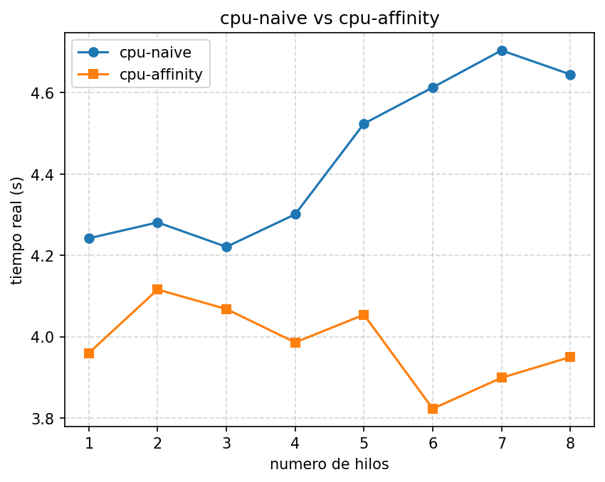

# Ejercicio A - cpu-naive vs cpu-affinity

Fabián Parreaguirre Hidalgo

Hardware Info:

Processor: Intel Core i5-1135G7 (11va gen, 2.40GHz base)
Cores: 4 físicos
Threads: 8 lógicos (hyperthreading)
Compilador: gcc 15.2.0

Le agregué un argumento de N hilos a los dos programas (antes estaba fijo en 8). Barrido de 1 a 8 en `medir.sh`.

| Hilos | cpu-naive (s) | cpu-affinity (s) |
|---|---|---|
| 1 | 4.242 | 3.960 |
| 2 | 4.281 | 4.116 |
| 3 | 4.221 | 4.068 |
| 4 | 4.301 | 3.986 |
| 5 | 4.524 | 4.054 |
| 6 | 4.613 | 3.823 |
| 7 | 4.704 | 3.899 |
| 8 | 4.645 | 3.950 |

- El tiempo no baja con más hilos, se mantiene casi plano en los dos. Cada hilo hace su propio trabajo fijo (256MB, 10 iteraciones) sin importar cuántos más haya, así que no hay nada que repartir: es escalamiento débil, no el caso de Amdahl con problema de tamaño fijo.
- `cpu-affinity` gana en todos los puntos (3.8-4.1s contra 4.2-4.7s de `cpu-naive`).
- La diferencia es por migración de threads: sin `pthread_setaffinity_np` el scheduler puede mover el hilo de core y pierde la cache caliente; con la afinidad se queda fijo todo el tiempo. Se nota más con 6-8 hilos, cuando ya casi no quedan cores libres.
